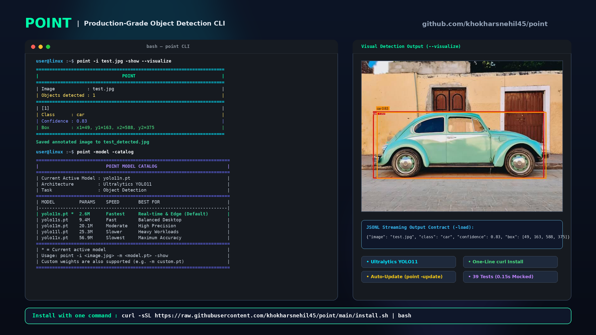

# Point

<p align="center">
  <strong>A lightweight, production-grade command-line object detection tool powered by Ultralytics YOLO.</strong>
</p>

<p align="center">
  
  
  
  
</p>

<p align="center">
  
</p>

```text
Image(s) / Directory ──▶ Point ──▶ Object Detection Model ──▶ Detection Results
```

Point takes an image, multiple images, or entire folders, executes an object detection model under the hood, and exposes the results through a clean, developer-friendly terminal interface, structured JSONL exports, and visual bounding-box overlays.

---

## Single-Line Install

Install Point instantly with a single command (Linux / macOS):

```bash
curl -sSL https://raw.githubusercontent.com/khokharsnehil45/point/main/install.sh | bash
```

The script configures an isolated virtual environment and creates a binary link at `~/.local/bin/point`.

### Manual Installation (git & pip)

```bash
git clone https://github.com/khokharsnehil45/point.git
cd point

# Install package and binary entry point
pip install .

# Or editable mode for development
pip install -e ".[dev]"
```

---

## Quick Start

```bash
# 1. View detection results framed in terminal pipes
point -i street.jpg -show

# 2. Batch process an entire directory of images
point -i ./photos/ -show

# 3. Export detections across multiple images to a JSONL file
point -i img1.jpg img2.jpg -load batch_results

# 4. Save annotated images with bounding boxes into an output directory
point -i "images/*.jpg" --visualize ./annotated/

# 5. Combine all three in a single run
point -i ./photos/ -show -load detections -visualize ./output/

# 6. Check active model and available YOLO catalog
point -model -catalog

# 7. Update Point to the latest version
point -update
```

---

## CLI Command Reference

```text
usage: point [-h] [-i IMAGE [IMAGE ...]] [-show] [-load FILENAME]
             [-visualize [OUT_PATH]] [-o OUT_PATH] [-model [MODEL]]
             [-set-model MODEL_NAME] [-catalog] [-update] [-v]
```

| Flag | Shorthand | Description | Example |
| :--- | :--- | :--- | :--- |
| `--image` | `-i` | Input image(s), directory, or glob pattern | `point -i photo.jpg` or `point -i ./folder/` |
| `--show` | `-show` | Print detection results to the terminal | `point -i photo.jpg -show` |
| `--load` | `-load` | Export detections to a JSONL file | `point -i photo.jpg -load results` |
| `--visualize` | `-visualize` | Generate annotated image(s) with bounding boxes | `point -i photo.jpg --visualize` |
| `--output` | `-o` | Custom output path/directory for annotated image(s) | `point -i ./folder/ -o ./annotated/` |
| `--model` | `-m` | Specify model or checkpoint weights | `point -i photo.jpg -m yolo11s.pt` |
| `--set-model` | `-set-model`| Set permanent default model in user config | `point -set-model yolo11s.pt` |
| `--catalog` | `-catalog` | Display available YOLO models & active model | `point -model -catalog` |
| `--update` | `-update` | Update Point to latest version from GitHub | `point -update` |
| `--version` | `-v` | Display Point version | `point -v` |
| `--help` | `-h` | Display usage instructions and help | `point --help` |

---

## Visual Feature Walkthrough

### 1. Piped Terminal Results (`-show`)

Point formats all detections within an adaptive pipe-framed card:

```bash
point -i street.jpg -show
```

```text
=======================================================
|                        POINT                        |
=======================================================
| Image            : street.jpg                       |
| Objects detected : 4                                |
=======================================================
| [1]                                                 |
| Class      : person                                 |
| Confidence : 0.94                                   |
| Box        : x1=124, y1=82, x2=318, y2=641          |
|                                                     |
| [2]                                                 |
| Class      : car                                    |
| Confidence : 0.91                                   |
| Box        : x1=402, y1=275, x2=781, y2=512         |
|                                                     |
| [3]                                                 |
| Class      : bicycle                                |
| Confidence : 0.87                                   |
| Box        : x1=50, y1=310, x2=290, y2=590          |
|                                                     |
| [4]                                                 |
| Class      : traffic light                          |
| Confidence : 0.83                                   |
| Box        : x1=820, y1=91, x2=864, y2=182          |
=======================================================
```

### 2. Batch & Directory Processing

Process multiple individual images, entire folders, or glob patterns in a single high-performance command:

```bash
# Process multiple images
point -i img1.jpg img2.jpg img3.jpg -show

# Scan and process an entire directory (flat or nested)
point -i ./datasets/val/ -show

# Use glob wildcards
point -i "camera_feeds/*.png" -load feed_detections -o ./annotated_feeds/
```

When evaluating multiple images, Point outputs a clean **Batch Summary** header followed by individual image cards:

```text
=======================================================
|                 POINT BATCH SUMMARY                 |
=======================================================
| Total Images     : 3                                |
| Total Detections : 14                               |
=======================================================
```

---

### 3. JSONL Serialization (`-load`)

```bash
point -i street.jpg -load detections
```

Automatically generates `detections.jsonl`. Extension deduplication ensures `-load results.jsonl` does not append duplicate extensions.

Each line contains exactly one detection record:

```json
{"image": "street.jpg", "class": "person", "class_id": 0, "confidence": 0.94, "box": [124, 82, 318, 641]}
{"image": "street.jpg", "class": "car", "class_id": 2, "confidence": 0.91, "box": [402, 275, 781, 512]}
{"image": "street.jpg", "class": "bicycle", "class_id": 1, "confidence": 0.87, "box": [50, 310, 290, 590]}
{"image": "street.jpg", "class": "traffic light", "class_id": 9, "confidence": 0.83, "box": [820, 91, 864, 182]}
```

---

### 3. Visual Image Overlay (`--visualize` / `-o`)

Render high-contrast, multi-class colored bounding boxes with confidence badges directly onto your image:

```bash
# Save to default name (e.g. street_detected.jpg)
point -i street.jpg --visualize

# Or save to a specific output path
point -i street.jpg -o ./output/annotated.jpg
```

---

### 4. Model Catalog & Selection

Inspect active model parameters, inference speeds, and recommended use cases:

```bash
point -model -catalog
```

```text
========================================================================
|                         POINT MODEL CATALOG                          |
========================================================================
| Current Active Model : yolo11n.pt                                    |
| Architecture         : Ultralytics YOLO11                            |
| Task                 : Object Detection                              |
========================================================================
| MODEL         PARAMS    SPEED       BEST FOR                         |
|----------------------------------------------------------------------|
| yolo11n.pt *  2.6M      Fastest     Real-time & Edge (Default)       |
| yolo11s.pt    9.4M      Fast        Balanced Desktop                 |
| yolo11m.pt    20.1M     Moderate    High Precision                   |
| yolo11l.pt    25.3M     Slower      Heavy Workloads                  |
| yolo11x.pt    56.9M     Slowest     Maximum Accuracy                 |
========================================================================
| * = Current active model                                             |
| Usage: point -i <image.jpg> -m <model.pt> -show                      |
| Custom weights are also supported (e.g. -m custom.pt)                |
========================================================================
```

---

### 5. Configuring the Active Model

Point supports three levels of model configuration:

1. **Permanently set default**:
   ```bash
   point -set-model yolo11s.pt
   ```
   Persisted to `~/.config/point/config.json`.
2. **Environment variable override**:
   ```bash
   export POINT_MODEL=yolo11m.pt
   ```
3. **Per-command override**:
   ```bash
   point -i image.jpg -m yolo11x.pt -show
   ```

---

### 6. Self-Updating (`point -update`)

Keep Point updated to the latest upstream release with one command:

```bash
point -update
```

---

## Clean Error Handling

Errors are presented clearly without tracebacks:

- **Missing File**:
  ```text
  Error: Image not found: does-not-exist.jpg
  ```
- **Corrupt File**:
  ```text
  Error: Could not read image: corrupt.jpg
  ```
- **Model Loading Error**:
  ```text
  Error: Failed to load detection model 'invalid.pt': ...
  ```

---

## Project Architecture

```text
point/
├── install.sh               # Single-line curl installer
├── pyproject.toml           # PEP 621 package metadata & scripts
├── README.md                # Documentation & guides
├── LICENSE                  # MIT License
├── .gitignore               # Ignored build, environment & weights
│
├── point/
│   ├── __init__.py          # Public exports & versioning
│   ├── cli.py               # CLI parser, command dispatcher, error exits
│   ├── config.py            # Persistent settings & configuration priority
│   ├── detector.py          # Abstract Detector & YOLODetector backend
│   ├── models.py            # Detection dataclass and domain exceptions
│   ├── output.py            # Pipe-framed formatting & JSONL serialization
│   ├── updater.py           # Self-update pipeline
│   ├── version.py           # Version definition
│   └── visualization.py     # Image annotation overlay utilities
│
└── tests/
    ├── conftest.py          # Isolated test configuration fixtures
    ├── test_cli.py          # CLI integration and command testing
    ├── test_detector.py     # Abstract detector and mocked YOLO unit tests
    ├── test_output.py       # Output formatting, JSONL schema, and models
    └── test_visualization.py # Visual bounding box rendering tests
```

---

## Development & Testing

Run the offline automated test suite (39 tests, ~0.15s, no model downloads required):

```bash
# Run test suite
pytest -v

# Run with test coverage
pytest --cov=point tests/
```

---

## License

This project is licensed under the MIT License. See [LICENSE](LICENSE) for details.
